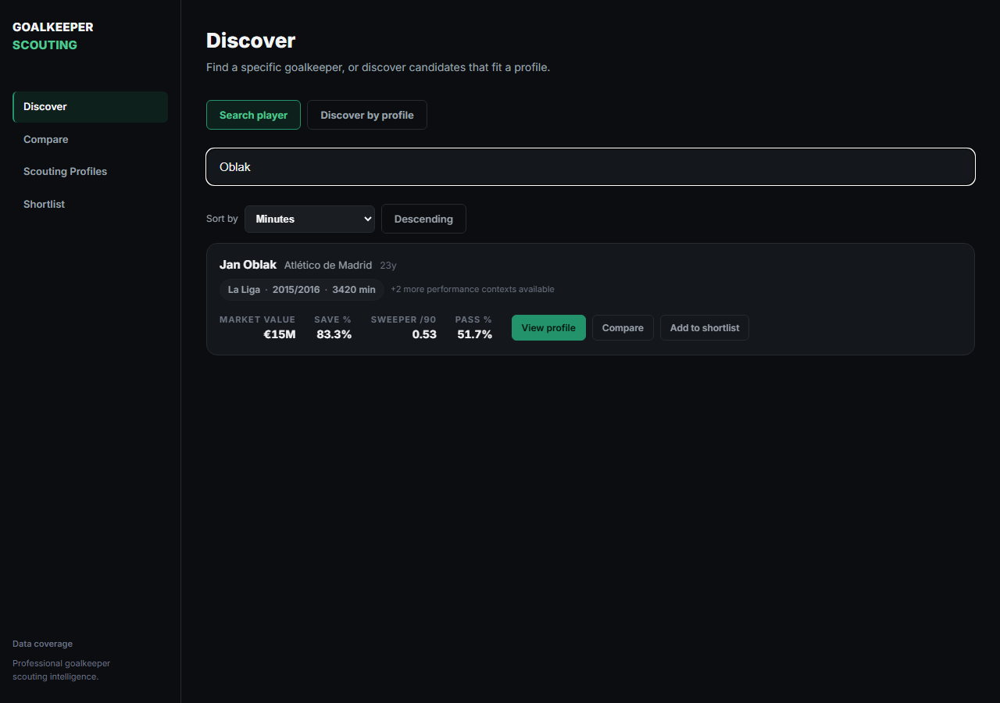
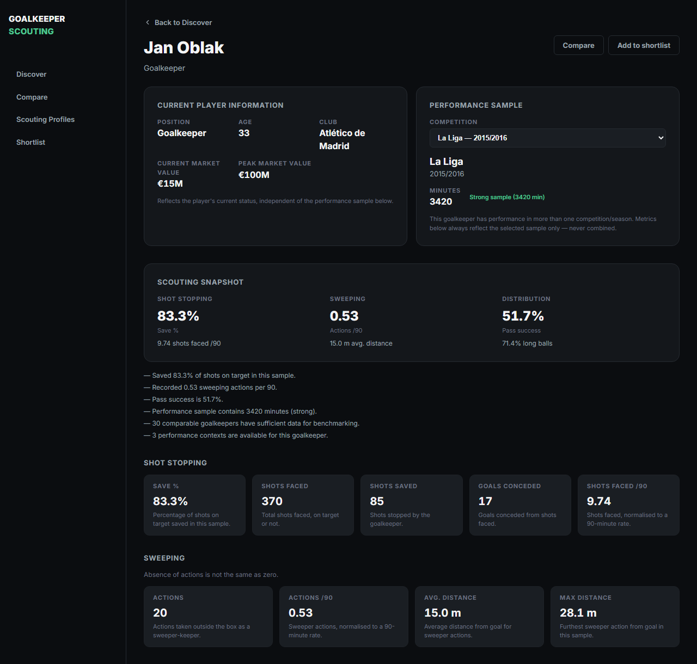
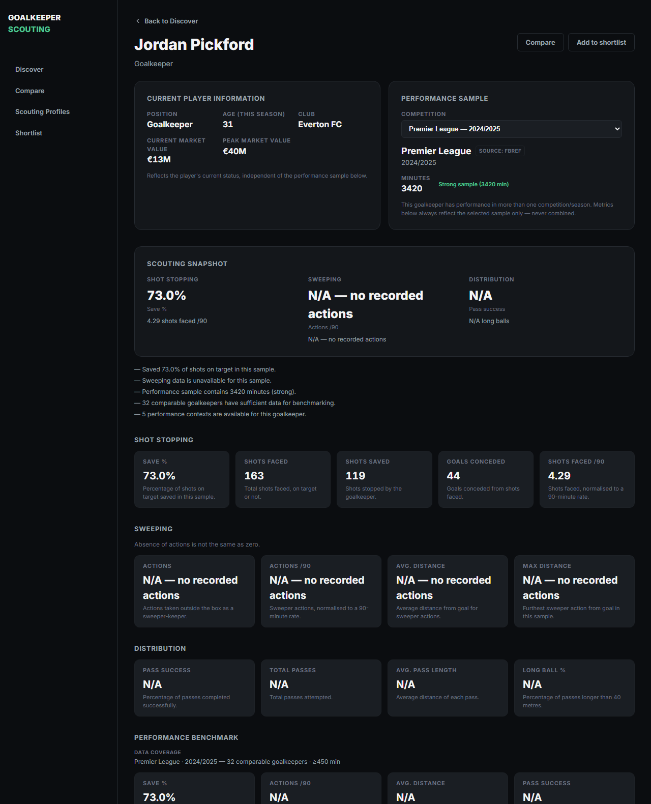
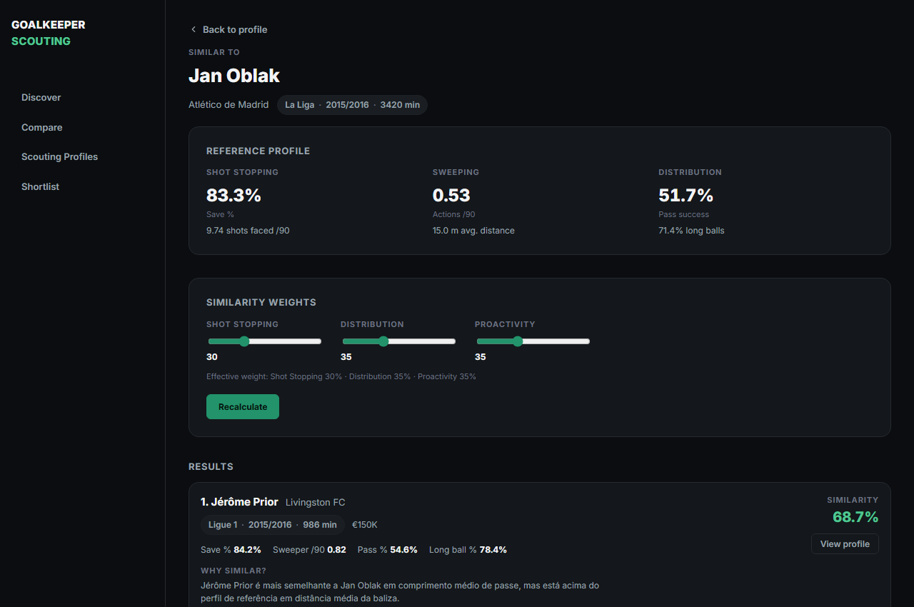
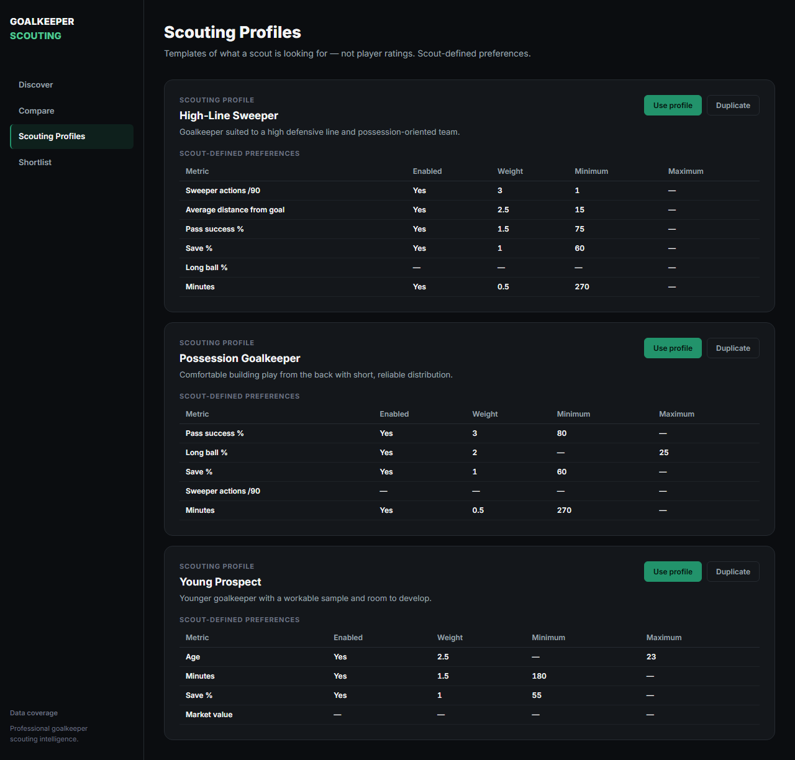
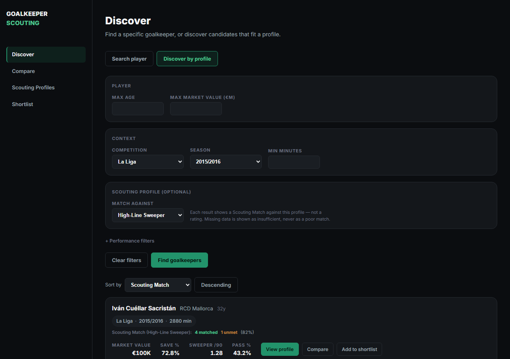
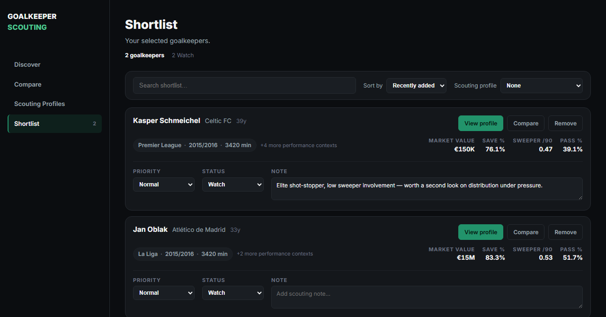
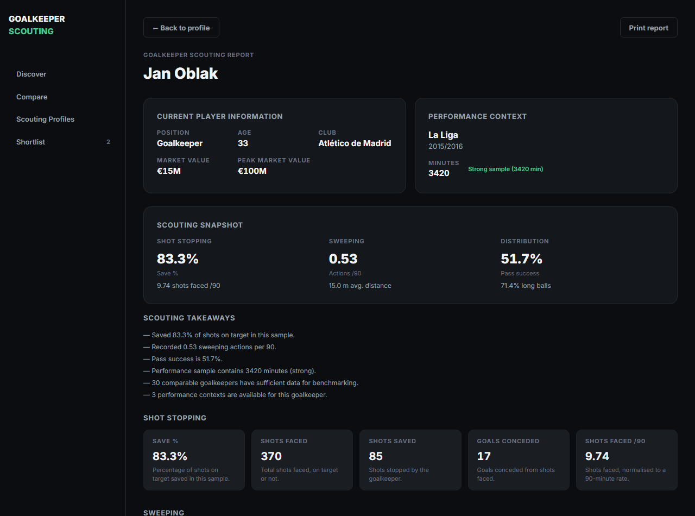
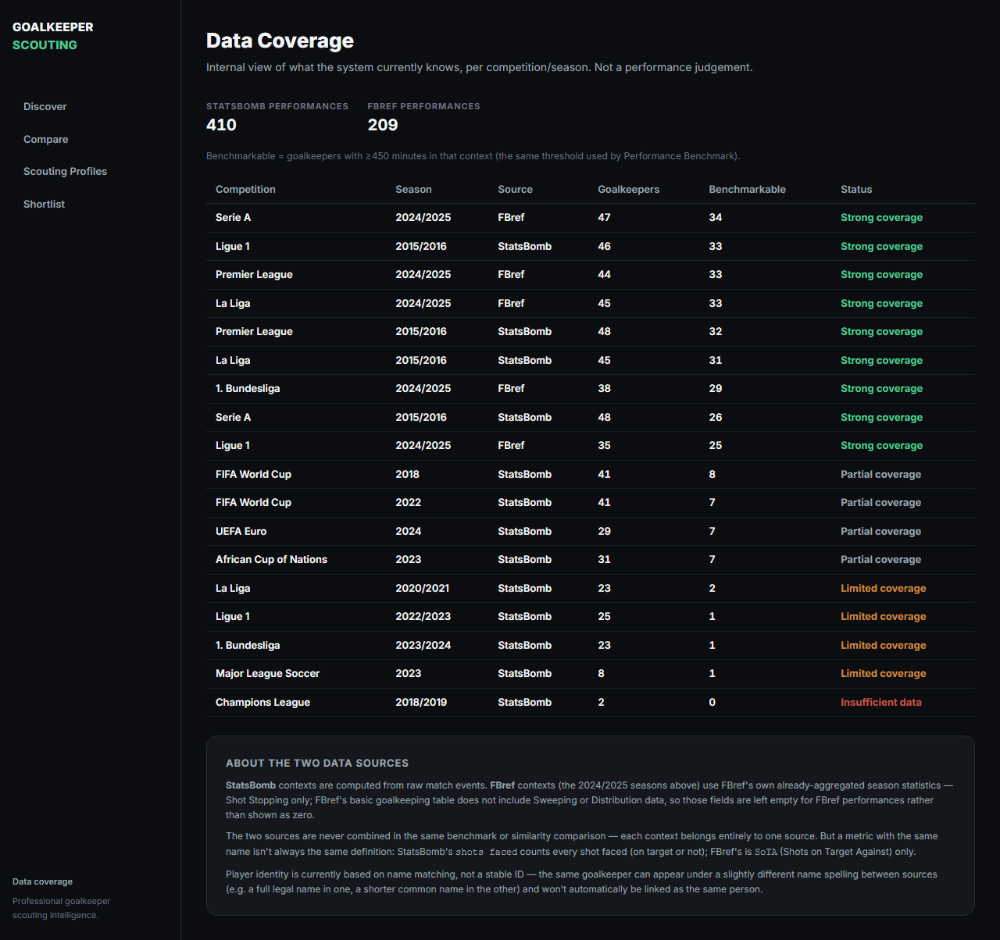

# Goalkeeper Scouting 🧤⚽

> A data-driven scouting platform focused entirely on goalkeepers — real event data, real statistical benchmarking, and explainable scouting preferences instead of a black-box rating.

This is a personal portfolio project. It's built on free, open football data (StatsBomb Open Data) and is deliberately designed to be **transparent**: every number you see is traceable to a metric, a sample size, and a real comparison group. There is no single "goalkeeper score."

---

## What is this?

Goalkeeper analytics is often less comprehensively represented in general football analytics tools than outfield and attacking analysis. Goalkeeper Scouting tries to fix that, following a scout's actual workflow:

**Discover** candidates → **Profile** a goalkeeper in context → **Benchmark** them against real peers → find **Similar** goalkeepers → match against a **Scouting Profile** → **Shortlist** and add notes → generate a print-ready **Scouting Report**.

Most of the dataset is computed from raw StatsBomb match events — saves, sweeper actions, passes — not pre-aggregated stats from someone else's site. A smaller, clearly-labelled 2024/25 slice is the exception: see [Data](#data) below.

---

## See it in action

Here's a walkthrough of a real scouting session, screenshotted straight from the running app against the live dataset.

### 1. Start on Discover

Search for a specific goalkeeper by name, or switch to "Discover by profile" to filter by competition, season, age, market value, minutes and performance thresholds.



### 2. Open a Player Profile

Everything about one goalkeeper, in one specific competition/season sample — market context, a performance snapshot, plain-language takeaways, and a peer-group benchmark with real percentiles (never a global "how good is this keeper" score).



The same page handles an incomplete sample just as honestly. Jordan Pickford's 2024/25 Premier League season comes from FBref (see [Data](#data)) — a small "Source: FBref" label marks it, Shot Stopping and its benchmark percentile are real, and Sweeping/Distribution show `N/A — no recorded actions` rather than a fabricated `0`, because that source genuinely doesn't have those fields yet.



### 3. Find Similar Goalkeepers

Adjustable-weight style similarity across Shot Stopping, Distribution and Proactivity, with a short explanation of what's closest and what differs between two players. Clearly labelled as model output, not a scout's judgement.



### 4. Or start from what you're looking for: Scouting Profiles

Instead of a reference player, define what you actually want — a **High-Line Sweeper**, a **Possession Goalkeeper**, a **Young Prospect** — as a set of weighted preferences with minimums/maximums. This is scout-defined criteria, never a rating.



### 5. Discover, matched against that profile

Turn the profile filter on and every result gets a **Scouting Match** badge — matched / unmet / insufficient-data counts, plus an optional, secondary, explainable match percentage. Missing data is never treated as a poor match.



### 6. Shortlist and annotate

Save candidates, set priority and status, and add scout notes — kept visibly separate from the statistical evidence above them.



### 7. Generate the Scouting Report

A single, print-ready page combining the snapshot, takeaways, full metric breakdown, benchmark, similar goalkeepers and scout notes for one player/context — ready to hand to someone else.



### 8. And know exactly how much to trust it

The Data Coverage page shows, per competition/season, how many goalkeepers the system actually has and how many clear the benchmarking threshold — no invented numbers, no hiding a thin sample. It also names the source of every context (StatsBomb or FBref) and explains, in plain language, where the two sources differ.



---

## Data

**[StatsBomb Open Data](https://github.com/statsbomb/open-data)** is the performance source — free, event-level football data (every pass, shot, and goalkeeper action, located on the pitch). Every metric in this project is derived directly from those raw events, not taken pre-calculated from anywhere.

**Transfermarkt** supplies market value, age, and current club — kept deliberately separate from performance data, so a player's market status never leaks into their statistical sample.

**FBref (2024/25, Shot Stopping only)** — a bounded exception to the rule above. StatsBomb Open Data has no current-season league coverage, so save %, shots faced, shots saved, and goals conceded for the Premier League, La Liga, Bundesliga, Serie A, and Ligue 1 2024/25 seasons come from a one-time manual export of FBref's own already-aggregated goalkeeping table (209 rows, `source="fbref"` in the database, structurally isolated from StatsBomb — own competition IDs, own coverage rows, never combined in the same peer group or similarity comparison). This is not a running or scheduled scraper: FBref/Sports Reference's Terms of Use prohibit automated collection, so this was a deliberate, one-off, manually-triggered export for a portfolio project rather than a pipeline this repository runs on its own. See [Methodology](#methodology) for what this source can and can't fill in, and [Limitations](#limitations) for why it stops at Shot Stopping.

**Not used:** SofaScore, FotMob, Flashscore, and WhoScored were investigated as potential current-season sources and are not scraped or integrated anywhere in this project — each has terms-of-service language against automated collection at least as explicit as FBref's, and none was judged worth the same one-off exception.

## Methodology

- **Shot Stopping** — save %, shots faced/saved, goals conceded (shots that never forced a save are excluded from the save-% denominator)
- **Sweeping / Proactivity** — sweeper actions /90, average and max distance from goal for those actions
- **Distribution** — pass success %, average pass length, long-ball %

Minutes are computed from real lineup/substitution/red-card events, not estimated. A metric with no underlying events is shown as missing, never as `0`. Sample size is always visible next to every stat — the app tells you when a percentage is based on 3 shots vs. 30.

**FBref rows (2024/25) only ever populate Shot Stopping.** FBref's basic goalkeeping table has no equivalent to sweeper actions, defensive distance, or pass distribution, so those fields are `NULL` for FBref performances — never `0`, never estimated. A same-named metric isn't always the same definition either: StatsBomb's `shots_faced` counts every shot faced (on target or not); FBref's is `SoTA` (Shots on Target Against) only. The UI labels this explicitly on FBref performances rather than reusing the StatsBomb wording. FBref does publish an "Advanced Goalkeeping" table with sweeper/passing metrics, but the six columns this project would need from it (`#OPA`, `#OPA/90`, `AvgDist`, `Att (GK)`, `AvgLen`, `Launch%`) had zero non-null values across all 209 players in all five 2024/25 CSVs — FBref's source table returned those columns empty at the time of the 2024/25 export, confirmed by inspecting the raw scraped HTML cell-by-cell rather than assumed from the CSV alone. Rather than leave those fields unfilled with a guess, they stay `NULL`, exactly as this project's own rule requires: no invented approximation, ever.

**Performance Benchmark** compares a goalkeeper only against peers in the *same competition and season* (≥450 minutes by default), using percentile rank with tie handling. **Similarity** uses robust z-scores and a weighted exponential-decay function across six style metrics. **Scouting Match** evaluates one player, in one context, against one profile's preferences — always `matched` / `unmet` / `insufficient_data`, never a combined score presented as fact.

## Tech Stack

**Backend** — Python, FastAPI, PostgreSQL, SQLAlchemy, Alembic, pandas, [`statsbombpy`](https://pypi.org/project/statsbombpy/)
**Frontend** — React 19, TypeScript, Vite
**Data** — StatsBomb Open Data, FBref (2024/25 Shot Stopping only), Transfermarkt
**Testing** — pytest (289 tests), TypeScript build checks

## Dataset

| | |
|---|---|
| Goalkeeper-performance rows | **619** (410 StatsBomb + 209 FBref) |
| Unique players | **480** |
| Competition/season contexts | **18** (13 StatsBomb + 5 FBref) |
| Contexts with strong statistical coverage | **9** |

| Competition | Season | Source | Goalkeepers | Benchmarkable (≥450min) | Coverage |
|---|---|---|---:|---:|---|
| Serie A | 2024/2025 | FBref | 47 | 34 | Strong |
| Ligue 1 | 2015/2016 | StatsBomb | 46 | 33 | Strong |
| Premier League | 2024/2025 | FBref | 44 | 33 | Strong |
| La Liga | 2024/2025 | FBref | 45 | 33 | Strong |
| Premier League | 2015/2016 | StatsBomb | 48 | 32 | Strong |
| La Liga | 2015/2016 | StatsBomb | 45 | 31 | Strong |
| 1. Bundesliga | 2024/2025 | FBref | 38 | 29 | Strong |
| Serie A | 2015/2016 | StatsBomb | 48 | 26 | Strong |
| Ligue 1 | 2024/2025 | FBref | 35 | 25 | Strong |
| FIFA World Cup | 2018 | StatsBomb | 41 | 8 | Partial |
| FIFA World Cup | 2022 | StatsBomb | 41 | 7 | Partial |
| UEFA Euro | 2024 | StatsBomb | 29 | 7 | Partial |
| African Cup of Nations | 2023 | StatsBomb | 31 | 7 | Partial |
| La Liga | 2020/2021 | StatsBomb | 23 | 2 | Limited |
| Ligue 1 | 2022/2023 | StatsBomb | 25 | 1 | Limited |
| 1. Bundesliga | 2023/2024 | StatsBomb | 23 | 1 | Limited |
| Major League Soccer | 2023 | StatsBomb | 8 | 1 | Limited |
| Champions League | 2018/2019 | StatsBomb | 2 | 0 | Insufficient |

The four StatsBomb "strong" contexts are full **2015/16 season** releases (380 matches for La Liga/Premier League/Serie A, 377 for Ligue 1). The five FBref contexts are full **2024/25 seasons** — a more recent historical slice with large peer groups, but Shot Stopping only (see [Data](#data)/[Methodology](#methodology)).

**Important limitation:** StatsBomb Open Data is a static, historical release — it has no current-season league coverage at all, which is why FBref fills that specific gap. Bundesliga and MLS are capped at what StatsBomb has actually published for those leagues (34 and 6 matches). Champions League Open Data is extremely sparse (one match per season).

## Local Setup

```bash
git clone https://github.com/azeredo-99/Goalkeeper-Scouting.git
cd Goalkeeper-Scouting

python -m venv .venv
.venv\Scripts\activate          # Windows
source .venv/bin/activate       # macOS/Linux

pip install -r requirements.txt

docker compose up -d
alembic upgrade head
# copy .env.example to .env and set DATABASE_URL first

python download_extended_data.py
python ingest_performances.py

uvicorn gk_scouting.api.main:app --app-dir src --port 8000
```

The FBref 2024/25 slice (`source="fbref"`) is not part of this default flow — it was a one-off manual export (see [Data](#data)) using `fetch_fbref_gk_2024_25.py` and `ingest_fbref_2024_25.py`, and the raw CSVs it depends on live under `data/raw/fbref/2024-25/`. A fresh clone works fully without it; StatsBomb ingestion above is the repeatable, automatic path.

```bash
cd frontend
npm install
npm run dev
```

```bash
pytest
```

## Limitations

- **FBref's Advanced Goalkeeping table did not provide the Sweeping/Distribution fields we need for 2024/25 at the time of the export.** It was investigated as the way to fill those fields — the mapping was fully planned, down to the exact FBref column names — but the six target columns (`#OPA`, `#OPA/90`, `AvgDist`, `Att (GK)`, `AvgLen`, `Launch%`) had zero non-null values across all 209 players in all five 2024/25 CSVs, confirmed by inspecting the raw scraped HTML, not assumed from an empty CSV. Implementing the mapping as planned would add code for zero actual data. Left `NULL`, honestly, rather than filled with an approximation — same rule as everywhere else in this project.
- Player identity currently uses `(player_name, competition_id, season_id)` as the database key, not a stable numeric ID. The most recent audit found zero same-context name collisions, but a name-format mismatch *across* StatsBomb and FBref is confirmed and real: FBref tends to use short/common names ("Alisson"), StatsBomb full legal names ("Alisson Ramsés Becker") — at least 20 such pairs exist in the current dataset, unrecognized as the same person by the app. No fuzzy matching or alias system exists yet.
- Custom Scouting Profiles created in the UI live in browser storage only — server-side Discover matching still supports just the three built-in profiles.
- Portfolio project — no authentication, no multi-user support, no production deployment.

## Roadmap

**Done:** dataset expansion (5 StatsBomb competitions, 1,581 matches), FBref 2024/25 Shot Stopping integration (5 leagues, 209 rows, dual-source Data Coverage), Player Profile, Scouting Report, Performance Benchmark, Similar Goalkeepers, Scouting Profiles & Scouting Match, Data Coverage, Shortlist with scout notes.

**Investigated, blocked at the source:** FBref Advanced Goalkeeping (`keepersadv`) for Sweeping/Distribution on the 2024/25 slice — revisit once FBref actually publishes those columns for the season.

**Next:** a `player_id`-based identity model (also the fix for the cross-source name-format gap above), wiring custom Scouting Profiles into server-side Discover matching, deeper historical StatsBomb coverage.

---

## Author

**Guilherme Azeredo** 

[GitHub](https://github.com/azeredo-99) · [LinkedIn](https://www.linkedin.com/in/guilherme-azeredo-a11bb0254/)

## License / Data Attribution

For educational and portfolio purposes. StatsBomb Open Data is used under StatsBomb's public data terms — published analysis should credit StatsBomb ([media pack](https://statsbomb.com/media-pack/)). Transfermarkt data is subject to Transfermarkt's own terms. The FBref 2024/25 slice was obtained via a one-off manual export, not an automated pipeline this repository runs — see [Data](#data) for the full disclosure of what was done and why.
